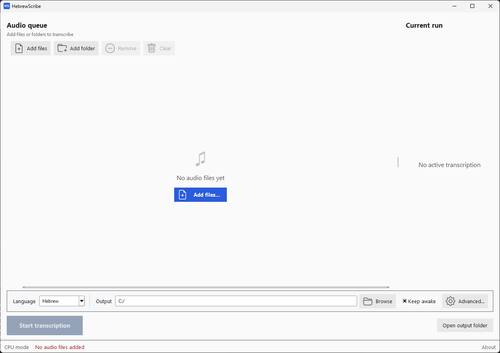

# HebrewScribe

A free, offline desktop application for batch transcription of Hebrew audio using local Whisper models.

HebrewScribe turns Hebrew audio files into text on your own computer, with no cloud services, no accounts, and no data leaving your machine. Queue a handful of recordings or an entire folder, and let it run. Powered by [faster-whisper](https://github.com/SYSTRAN/faster-whisper) and Whisper models fine-tuned for Hebrew by [ivrit-ai](https://huggingface.co/ivrit-ai).

## Why HebrewScribe?

- **Hebrew-first:** Ships with ivrit-ai/whisper-large-v3, a Whisper model fine-tuned specifically for Hebrew. Also supports English, Russian, French, and other languages
- **Private and open source:** All processing happens locally. No cloud, no telemetry, no accounts. The only network call is downloading a model the first time. [Source code on GitHub](https://github.com/yevgeniyglider/HebrewScribe) for full transparency
- **Batch-oriented:** Queue files and folders, reorder the queue mid-run, get per-file and batch ETAs with real-time progress
- **Free:** No subscriptions, no usage limits, no expiry

The process is entirely local:

- 14 audio formats supported (MP3, WAV, M4A, FLAC, OGG, and more)
- Voice Activity Detection filters silence for faster processing
- GPU acceleration when available (CUDA on Windows)
- Sleep prevention keeps your machine awake during long batches



## Quick Start

Download the Windows installer from [yevgeniyglider.com/hebrewscribe](https://yevgeniyglider.com/hebrewscribe/) and run it.

On macOS, install/build from source.

## Installation from Source

Requires Python 3.9+ and [FFmpeg](https://ffmpeg.org).

```bash
pip install -e ".[faster]"
```

Run with `python -m hebrewscribe`, or double-click `HebrewScribe.pyw` (Windows) / `HebrewScribe.command` (macOS).

## Architecture

HebrewScribe is a Python desktop application using tkinter for the GUI:

- **GUI:** tkinter with a custom flat theme, DPI-aware on Windows
- **Transcription:** [faster-whisper](https://github.com/SYSTRAN/faster-whisper) (CTranslate2-based)
- **Audio:** FFmpeg for format conversion
- **Models:** Curated selection from [ivrit-ai](https://huggingface.co/ivrit-ai) (Hebrew) and [Systran](https://huggingface.co/Systran) (multilingual), downloaded from Hugging Face Hub

The codebase is a single Python package (`hebrewscribe/`) with 8 focused modules: app, worker, models, outputs, power, theme, utils, and widgets. 252 tests cover the core logic.

## Project Map

```
HebrewScribe/
  LICENSE                          # MIT license text
  README.md                        # Project readme
  CHANGELOG.md                     # Release notes
  THIRD-PARTY-LICENSES.md         # Bundled dependency licenses
  pyproject.toml                   # Package metadata
  version_info.py                  # Windows EXE version metadata
  .editorconfig                    # Editor formatting defaults
  HebrewScribe.pyw                 # Windows launcher
  HebrewScribe.command             # macOS launcher
  HebrewScribe.spec                # PyInstaller Windows spec
  HebrewScribe-mac.spec            # PyInstaller macOS spec
  scripts/install-hooks.sh         # Git hook installer
  scripts/render_icons.py          # SVG-to-PNG build script
  icon.ico / icon.icns             # App icons
  screenshot.png                   # README screenshot
  hebrewscribe/                    # Source package (8 modules + icons)
  tests/                           # 252 tests
  assets/                          # SVG source icons
```

## Acknowledgments

- [faster-whisper](https://github.com/SYSTRAN/faster-whisper) by SYSTRAN for fast CTranslate2-based Whisper inference
- [Whisper](https://github.com/openai/whisper) by OpenAI for the speech recognition models
- [ivrit-ai](https://huggingface.co/ivrit-ai) for Hebrew-tuned Whisper models
- [FFmpeg](https://ffmpeg.org) for audio format handling

## License

MIT License. See [LICENSE](LICENSE) for the full text, and [THIRD-PARTY-LICENSES.md](THIRD-PARTY-LICENSES.md) for bundled dependency licenses.

---

[yevgeniyglider.com/hebrewscribe](https://yevgeniyglider.com/hebrewscribe/) · Built by [Yevgeniy Glider](https://yevgeniyglider.com)